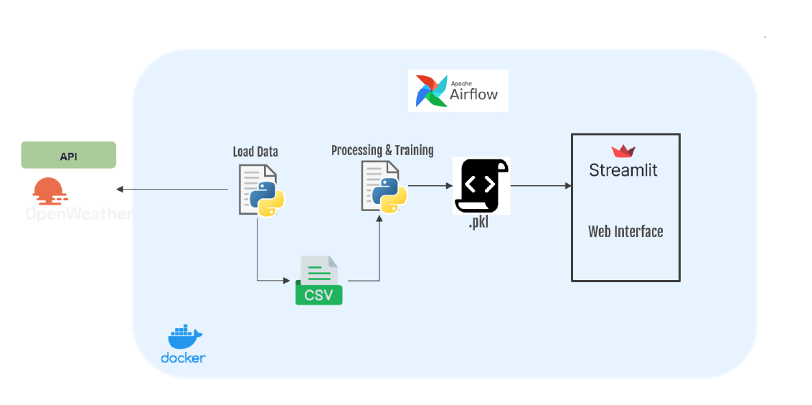

# OpenWeatherMap API Data Pipeline

This project involves building a data pipeline to collect weather data from the OpenWeatherMap API, preprocessing the data, training multiple machine learning models, and deploying the best-performing model in a web application. The entire pipeline is orchestrated using Apache Airflow with regular updates from the API.


## Repository Structure

- `dags/`: Apache Airflow DAG configuration files and the scripts directory.
- `dags/scripts/streamlit`: Holds files related to the web application .
- `dags/scripts/pickle_files`: Stores serialized machine learning models.
- `dags/scripts/dataset`: Confine the datasets.

## Getting Started

1. Clone this repository:

   
      ```bash
      
      git clone https://github.com/OUSSAMAOUHA/Implementation-of-a-continuous-training-pipeline-using-Apache-Airflow-and-Streamlit
      
     ```


2. Navigate to the Project Directory:


   ```bash

    cd openweathermap-data-pipeline

   ```

3. Ensure the creation of the specified directories with the following purposes:

- `./dags`: Dedicated to DAG files, this directory already exists in the repository, so there is no need to create it.
- `./logs`: Holds logs generated during task execution and scheduler operations.
- `./config`: Intended for custom log parser inclusion or the addition of `airflow_local_settings.py` to configure cluster policy.
- `./plugins`: Designated for the storage of custom plugins.

   ```bash
      mkdir dags
      mkdir logs
      mkdir plugins
      mkdir config
   ```
  - This directories in the container are mounted, which means that their contents are synchronized between your computer and the container.

4. Start Docker Containers:

   ```bash
   docker compose up
   ```
   ### Upon successful execution, the containers will be launched. Here is the expected outcome:
   


4. Access the Airflow UI at `http://localhost:8080` and trigger the DAG.
   


## Monitoring the Pipeline Progression

1. **Access the Airflow UI:**
   - Open your web browser and go to [http://localhost:8080](http://localhost:8080).

2. **Login:**
   - Log in with the following credentials:
        - Username: airflow
        - Password: airflow
3. **Locate the DAG:**
   - In the Airflow UI, find the DAG associated with your project (e.g., `openweathermap_data_pipeline`).

4. **View DAG Details:**
   - Click on the DAG to access detailed information.

5. **Check Task Status and Execution Times:**
   - Within the DAG details, observe the status of each task, their execution times, and any generated logs.

6. **Monitor Pipeline Evolution:**
   - Keep track of the flow of tasks to monitor the overall progression of the pipeline.

7. **Inspect Task Logs and Outputs:**
   - For more in-depth information, you can inspect individual task logs and outputs.


